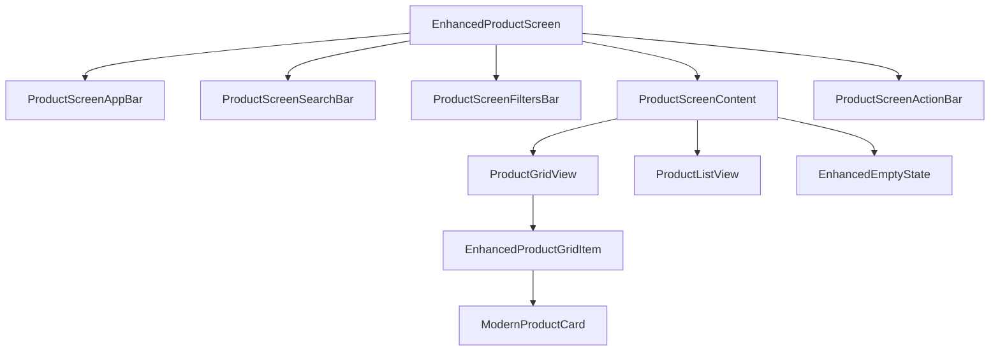
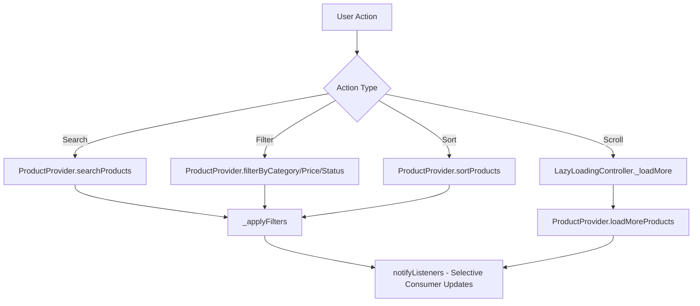
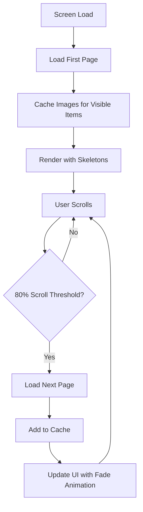
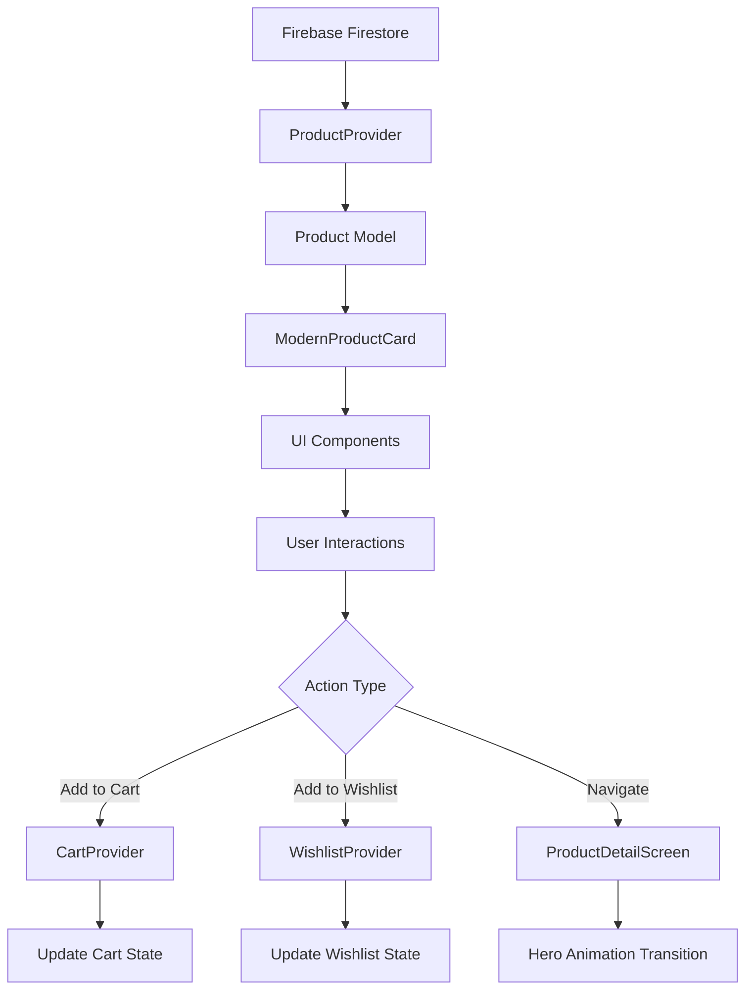

# Product Screen Comprehensive Improvements Specification

## Executive Summary

This specification outlines a comprehensive modernization of the `product_screen.dart` to significantly enhance user experience, performance, and maintainability while maintaining compatibility with existing ProductProvider, Product model, and navigation patterns.

## Current State Analysis

### Existing Components
- **Simple cards**: Basic `Card` widgets with limited functionality
- **Basic filtering**: ProductProvider supports category, price range, status filters
- **Basic sorting**: Name A-Z, price asc/desc only
- **No pagination**: All products loaded at once
- **Debug prints**: Console logging everywhere
- **No animations**: Static UI components
- **No performance optimizations**: Full rebuilds on every state change

### Existing Modern Components Available
- `ModernProductCard`: Feature-rich cards with badges, ratings, wishlist/cart integration, animations, responsive design
- `ProductFilterBottomSheet`: Comprehensive filtering UI
- `ProductSortBottomSheet`: Sorting options (needs enhancement)
- Catalog widgets: Empty state, hero banner, quick actions

## Component Architecture & New Widget Structure

### Main Screen Structure
```
EnhancedProductScreen
├── ProductScreenAppBar (enhanced)
├── ProductScreenSearchBar (enhanced)
├── ProductScreenFiltersBar (new)
├── ProductScreenStatsOverview (optional)
├── ProductScreenContent (main content)
│   ├── ProductGridView (with pagination/lazy loading)
│   ├── ProductListView (with pagination/lazy loading)
│   └── EnhancedEmptyState (improved messaging)
└── ProductScreenActionBar (sort/filter quick access)
```

### New Widget Components

#### 1. ProductScreenFiltersBar
```dart
class ProductScreenFiltersBar extends StatelessWidget {
  // Active filters display with quick remove
  // Sort indicator
  // Filter count badges
  // Quick filter toggles (active, on sale, etc.)
}
```

#### 2. ProductScreenContent
```dart
class ProductScreenContent extends StatefulWidget {
  // Pagination controller
  // Lazy loading logic
  // Grid/List view switching with animation
  // Pull-to-refresh implementation
}
```

#### 3. EnhancedProductGridItem
```dart
class EnhancedProductGridItem extends StatelessWidget {
  // Hero animation wrapper
  // Selective rebuild optimization
  // Image caching integration
}
```

## State Management Improvements

### Selective Consumer Usage
Instead of single Consumer<ProductProvider>, use multiple selective consumers:

```dart
// For search/filter state
Selector<ProductProvider, String>(
  selector: (context, provider) => provider.searchQuery,
  builder: (context, searchQuery, child) => SearchBar(query: searchQuery),
)

// For products list
Selector<ProductProvider, List<Product>>(
  selector: (context, provider) => provider.products,
  builder: (context, products, child) => ProductGrid(products: products),
)
```

### New Provider Methods
```dart
class ProductProvider {
  // Enhanced sorting with all options
  void sortProducts(String sortBy) {
    switch (sortBy) {
      case 'rating': _sortOption = 'rating_desc'; break;
      case 'newest': _sortOption = 'newest'; break;
      case 'popular': _sortOption = 'popular'; break;
      case 'bestseller': _sortOption = 'bestseller'; break;
      // ... existing cases
    }
    _applyFilters();
  }

  // Pagination support
  Future<void> loadMoreProducts() async {
    if (_isLoading || !_hasMoreProducts) return;
    _isLoading = true;
    notifyListeners();

    try {
      final newProducts = await _fetchProductsPage(_currentPage + 1);
      _products.addAll(newProducts);
      _currentPage++;
      _hasMoreProducts = newProducts.length == _pageSize;
    } finally {
      _isLoading = false;
      notifyListeners();
    }
  }
}
```

## Data Flow Optimizations

### Pagination Strategy
- **Page Size**: 20 products per page (configurable)
- **Lazy Loading**: Load next page when user scrolls to 80% of current content
- **Cache Management**: Keep 3 pages in memory, discard older pages
- **Refresh**: Pull-to-refresh reloads first page and clears cache

### Image Caching Strategy
```dart
class ProductImageCache {
  static final Map<String, ImageProvider> _cache = {};

  static ImageProvider getCachedImage(String url) {
    if (_cache.containsKey(url)) return _cache[url]!;
    final provider = CachedNetworkImageProvider(url);
    _cache[url] = provider;
    return provider;
  }

  static void clearCache() => _cache.clear();
}
```

## Performance Enhancements

### 1. Image Optimization
- Preload images for visible products only
- Use CachedNetworkImage for automatic caching
- Implement progressive loading with placeholders
- Compress images on upload side

### 2. Rebuild Optimization
- Use const constructors where possible
- Memoize expensive computations
- Selective Consumer usage as shown above
- Keys for stable widget identity

### 3. Lazy Loading Implementation
```dart
class LazyLoadingGrid extends StatefulWidget {
  @override
  State<LazyLoadingGrid> createState() => _LazyLoadingGridState();
}

class _LazyLoadingGridState extends State<LazyLoadingGrid> {
  final ScrollController _scrollController = ScrollController();
  bool _isLoadingMore = false;

  @override
  void initState() {
    super.initState();
    _scrollController.addListener(_onScroll);
  }

  void _onScroll() {
    if (_scrollController.position.pixels >
        _scrollController.position.maxScrollExtent * 0.8) {
      _loadMore();
    }
  }

  Future<void> _loadMore() async {
    if (_isLoadingMore) return;
    setState(() => _isLoadingMore = true);

    await Provider.of<ProductProvider>(context, listen: false)
        .loadMoreProducts();

    setState(() => _isLoadingMore = false);
  }
}
```

## Enhanced Functionality

### 1. Advanced Sorting
Extend ProductProvider sorting to include:
- **Rating (High to Low)**
- **Newest First** (by createdAt)
- **Popular First** (by viewCount/popularity score)
- **Best Sellers** (by soldCount)

### 2. Hero Animations
```dart
// In grid item
Hero(
  tag: 'product-image-${product.id}-0',
  child: Image.network(product.imageUrls.first),
)

// Navigation
Navigator.push(
  context,
  MaterialPageRoute(
    builder: (context) => ProductDetailScreen(product: product),
  ),
);
```

### 3. Wishlist/Cart Status Indicators
Already implemented in ModernProductCard:
- Heart icon for wishlist status
- Cart button shows "Added to Cart" when in cart
- Visual feedback on state changes

### 4. Enhanced Empty State
```dart
class EnhancedEmptyState extends StatelessWidget {
  final String searchQuery;
  final bool hasActiveFilters;

  Widget build(BuildContext context) {
    if (hasActiveFilters) {
      return Column(
        children: [
          Icon(Icons.filter_list_off, size: 64),
          Text('No products match your filters'),
          TextButton(
            onPressed: () => context.read<ProductProvider>().clearFilters(),
            child: Text('Clear All Filters'),
          ),
        ],
      );
    }

    if (searchQuery.isNotEmpty) {
      return Column(
        children: [
          Icon(Icons.search_off, size: 64),
          Text('No products found for "$searchQuery"'),
          TextButton(
            onPressed: () => _clearSearch(),
            child: Text('Clear Search'),
          ),
        ],
      );
    }

    // Default empty state
    return CatalogEmptyState();
  }
}
```

## Code Quality Improvements

### 1. Constants Extraction
Create `lib/utils/product_screen_constants.dart`:
```dart
class ProductScreenConstants {
  static const double gridCrossAxisSpacing = 16.0;
  static const double gridMainAxisSpacing = 16.0;
  static const int gridCrossAxisCount = 2;
  static const double listItemHeight = 100.0;
  static const int pageSize = 20;
  static const double scrollThreshold = 0.8;
  static const Duration searchDebounceDelay = Duration(milliseconds: 300);
}
```

### 2. Modular Components
Break down large build methods into smaller widgets:
- `ProductSearchBar` - Search functionality
- `ProductFiltersRow` - Active filters display
- `ProductGrid` - Grid view implementation
- `ProductList` - List view implementation
- `ProductPaginationIndicator` - Loading/pagination UI

### 3. Error Handling
```dart
class ProductErrorHandler {
  static void handleProductLoadError(BuildContext context, dynamic error) {
    ErrorDialogs.showErrorDialog(
      context,
      title: 'Failed to Load Products',
      message: 'Unable to load products. Please check your connection and try again.',
      onRetry: () => context.read<ProductProvider>().loadProducts(),
    );
  }
}
```

### 4. Accessibility Improvements
```dart
// Semantic labels
Semantics(
  label: 'Product ${product.name}, priced at ${product.formattedPrice}',
  child: ModernProductCard(product: product),
)

// Focus management
FocusNode _searchFocusNode = FocusNode();
_searchFocusNode.requestFocus();

// Screen reader announcements
SemanticsService.announce('Loaded ${products.length} products', TextDirection.ltr);
```

## Responsive Design

### Grid Layout Adaptations
```dart
int getGridCrossAxisCount(BuildContext context) {
  final width = MediaQuery.of(context).size.width;
  if (width >= 1200) return 4; // Desktop
  if (width >= 900) return 3;  // Tablet landscape
  if (width >= 600) return 2;  // Tablet portrait
  return 2; // Mobile (keep 2 for better UX)
}
```

### Touch Targets & Spacing
- Minimum touch target: 44x44 dp
- Grid spacing: Responsive based on screen size
- Button padding: Adaptive margins
- Text sizes: Scale with screen width

### Orientation Support
- Portrait: Standard grid layout
- Landscape: Wider grid (more columns)
- Handle keyboard appearance on mobile
- Adjust spacing for different aspect ratios

## UI/UX Enhancements

### Mockup Description: Modern Product Screen

**Header Section:**
- Clean app bar with search icon and filter toggle
- Inline search bar with clear button and filter indicators
- Filter bar showing active filters as removable chips

**Content Area:**
- Responsive grid: 2 columns mobile, 3 tablet, 4 desktop
- ModernProductCard with:
  - Hero-ready product images
  - Multi-badge system (NEW, SALE, BESTSELLER, etc.)
  - Rating stars and review count
  - Wishlist heart button (animated)
  - Add to cart button (shows cart status)
  - Responsive sizing and padding

**Bottom Section:**
- Sort/Filter floating action buttons
- Pagination indicator (loading more...)
- Pull-to-refresh with smooth animation

**Empty States:**
- No products: Encouraging messaging with browse suggestions
- No search results: Clear search option with filter info
- No filter results: Clear filters option

**Loading States:**
- Skeleton screens for initial load
- Progressive loading indicators
- Smooth transitions between states

## Integration Points

### Existing Providers Compatibility
- **ProductProvider**: Extended with new sorting, pagination methods
- **CartProvider**: Integrated via ModernProductCard
- **WishlistProvider**: Integrated via ModernProductCard
- **ThemeProvider**: Full theme support
- **AuthProvider**: Shop owner features

### Navigation Patterns
- Maintain existing ProductDetailScreen navigation
- Add hero animations for seamless transitions
- Preserve deep linking capabilities

### Firebase Integration
- Maintain existing Firestore queries
- Add pagination query support
- Preserve real-time updates capability

## Implementation Plan & Mermaid Diagrams

### Component Hierarchy


### State Management Flow


### Performance Optimization Flow


### Data Flow Architecture


This comprehensive specification provides a blueprint for transforming the product screen into a modern, performant, and user-friendly component while maintaining full backward compatibility.